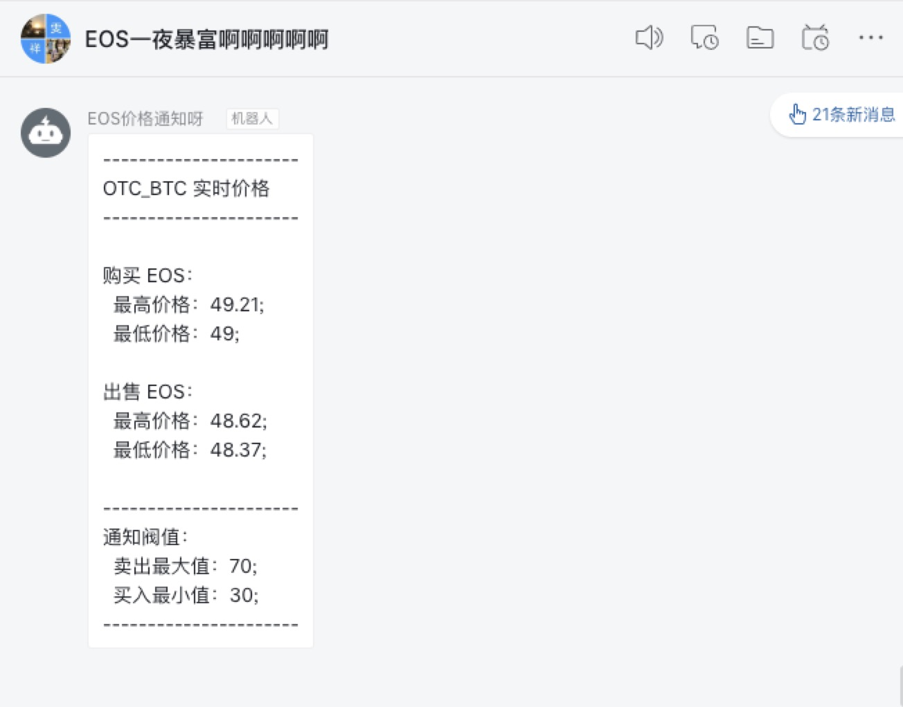

# cv_monitor
Monitor virtual currency through exchanges

####不错过每个抄底/套现的时刻

```
通过交易所抓取指定代币的价格，并发送自定义通知到钉钉群中 ； 
配置一个阀值，一旦超过这个阀值就会@自己 ； 
目前《硬编码》支持交易所 OTCBTC（emmmmm，方便套现）; 
后续慢慢支持其他
```

####如何使用

下载或者 clone 代码
```
 git下载：
 git clone https://github.com/lovefive5/cv_monitor
 
 pip下载：
 pip install cv_monitor
```

按需修改 otcbtc_eos/conf.py 中备注的地方
```
config = {
    "vc_name": 'BTC',  # ETH,EOS等都可配置,想监控哪个就填哪个（前提是此交易所支持此币种)
    "otc_buy_url": "https://otcbtc.io/sell_offers?currency={0}&fiat_currency=cny&payment_type=all",
    "otc_sell_url": "https://otcbtc.io/buy_offers?currency={0}&fiat_currency=cny&payment_type=all",
    "ding_notice_url": "https://oapi.dingtalk.com/robot/send?access_token=token_id",  # 钉钉群机器人提供的通知url
    "ding_notice_at": ['123****5678'],  # 钉钉要@的用户的手机号
    "max": 70,  # 最大值通知阀值
    "min": 37  # 最小值通知阀值
}
```

使用 crontab 定时运行
```
*/1 * * * * root python cv_monitor/otctc_eos/index.py
```





